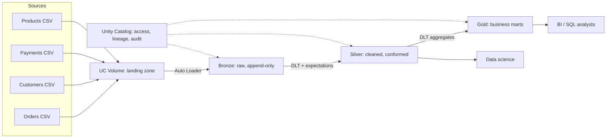
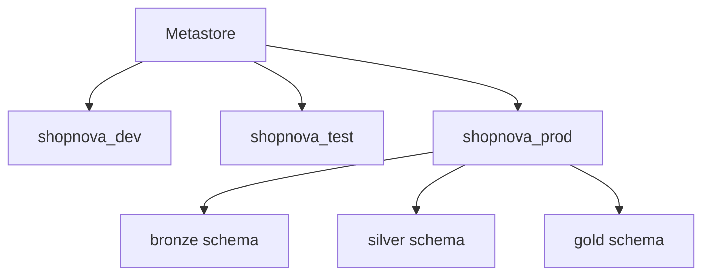

# Architecture

## Logical data flow

```mermaid
flowchart LR
  subgraph Sources
    S1[Orders CSV]
    S2[Customers CSV]
    S3[Payments CSV]
    S4[Products CSV]
  end

  S1 & S2 & S3 & S4 --> V[UC Volume: landing zone]
  V -->|Auto Loader| B[Bronze: raw, append-only]
  B -->|DLT + expectations| SV[Silver: cleaned, conformed]
  SV -->|DLT aggregates| G[Gold: business marts]
  G --> BI[BI / SQL analysts]
  SV --> DS[Data science]

  UC[Unity Catalog: access, lineage, audit] -.-> B
  UC -.-> SV
  UC -.-> G
```

## Unity Catalog layout

```mermaid
flowchart TB
  M[Metastore] --> D[shopnova_dev]
  M --> T[shopnova_test]
  M --> P[shopnova_prod]
  P --> PB[bronze schema]
  P --> PS[silver schema]
  P --> PG[gold schema]
```

Pattern: one catalog per environment, one schema per layer. Domain-based
alternatives are evaluated in a later ADR.